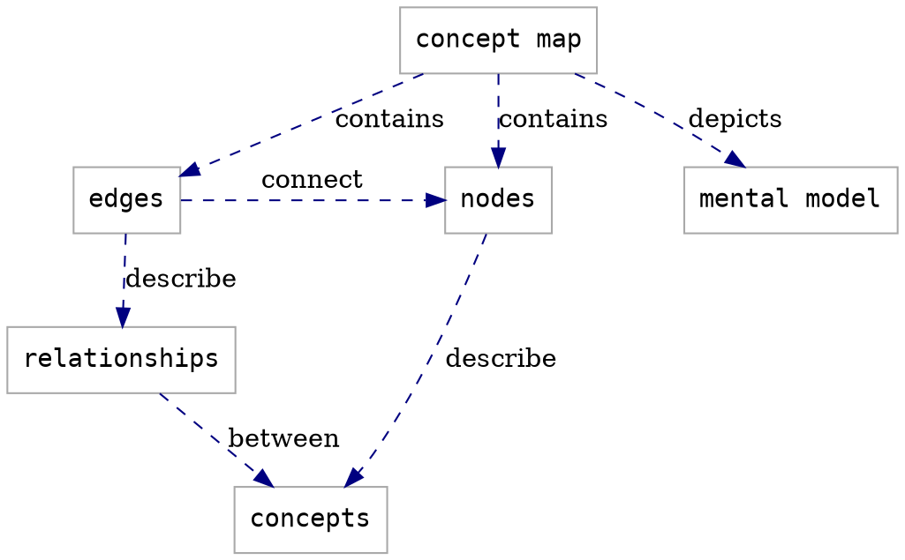

# Lesson Design Notes Template

:::info
Users are expected to follow **[The Carpentries Code of Conduct](https://docs.carpentries.org/topic_folders/policies/code-of-conduct.html)**.

All content is publicly available under the [Creative Commons Attribution License](https://creativecommons.org/licenses/by/4.0/).
:::

**Lesson Title:** FIXME  

<!-- inserts a Table fo Contents: don't change the line below -->
[TOC]

## Target Audience

Tomas is a third year undergraduate computer science student who is interested in machine learning and exploring biases in algorithms. He has taken introductory courses in math, statistics, and programming with compiled languages like Java and C. He is beginning to focus on the higher level courses relevant to his areas of interest.

Tomas' advisor is senior personnel on a project to develop a scalable smart grid. The team has recently gained access to several years' worth of solar power generation data from an experimental test bed. The data are split into one Excel file per month, and each file includes extra header rows that need to be removed before files can be combined into a single, master dataset. As sensors have changed and been replaced over time, the headers may not be the same in every file. Tomas manually inspects each file to verify the headers are consistent.

The project is a little behind schedule and Tomas' advisor would like him to produce a statistical analysis of the complete time series. This includes fitting a model for analysis, identifying and resolving outliers and null data, and sharing summary tables and plots with the team. In the past these tables and plots have been shared via email.

Because of the pandemic, Tomas is attending class remotely and coming to campus to work in the lab two days a week. Tomas does not have reliable internet access at home, and his family shares one laptop that must be left running overnight to compile and analyze the data.

Software Carpentry will teach Tomas how to write programs to merge and analyze tabular data files, how to create visualizations of the analysis and document the parameters and changes to his code so he can communicate his decisions to his advisor. It will also teach him to use version control systems to collaborate with the distributed project team.

### Notes

FIXME add any relevant information about how and why you chose this target audience here. Information like this can be helpful for future collaborators/contributors/users to understand the scope of your lesson.

## Learning Objectives

FIXME fill in the block below with learning objectives for your whole lesson, then move the whole block to `index.md`

> ## Learning Objectives
> After following this lesson, learners will be able to:
>  
> - objective 1
> - objective 2
> - ...
> - objective N
> 
{: .objectives }

### Notes

FIXME add any relevant information about how and why you defined these objectives here. Information like this can be helpful for future collaborators/contributors/users to understand the scope of your lesson.

## Concept Maps

FIXME Add concept map(s) for your lesson here. You can  embed a photo or other image file, or use the [GraphViz](https://graphviz.org/) syntax demonstrated below.

### Lesson Concept Map

You can put concepts maps for the whole lesson here...

### Episode Concept Maps

...and concept maps for individual episodes here.

## Data Set

FIXME add notes here about any criteria you used when choosing a data set for your lesson.  
What are the advantages of this data set?  
Do you anticipate any challenges associated with using this data in the lesson?  
Did you identify any other data sets and/or example tasks that could also be used to teach this lesson?

## Additional Design Notes

FIXME add notes to this section that do not fit elsewhere
in the page. Topics for this section might include

- what has been tried that did not work
- 

:::info
General questions or feedback? Contact [team@carpentries.org](mailto:team@carpentries.org).
:::
