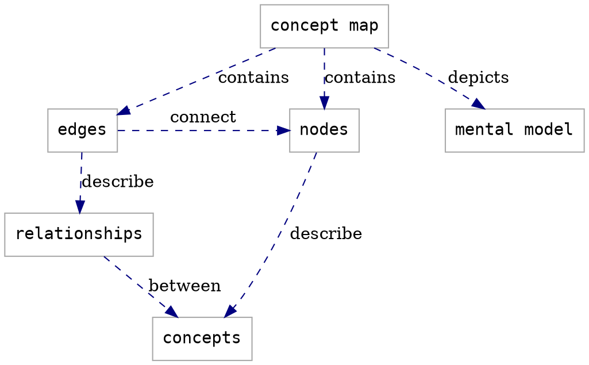

# Lesson Design Notes Template

:::info
Users are expected to follow **[The Carpentries Code of Conduct](https://docs.carpentries.org/topic_folders/policies/code-of-conduct.html)**.

All content is publicly available under the [Creative Commons Attribution License](https://creativecommons.org/licenses/by/4.0/).
:::

**Lesson Title:** FIXME  

<!-- inserts a Table fo Contents: don't change the line below -->
[TOC]

## Target Audience

FIXME add learner profiles for your lesson here

### Notes

FIXME add any relevant information about how and why you chose this target audience here. Information like this can be helpful for future collaborators/contributors/users to understand the scope of your lesson.

## Learning Objectives

FIXME fill in the block below with learning objectives for your whole lesson, then move the whole block to `index.md`

> ## Learning Objectives
> After following this lesson, learners will be able to:
>  
> - objective 1
> - objective 2
> - ...
> - objective N
> 
{: .objectives }

### Notes

FIXME add any relevant information about how and why you defined these objectives here. Information like this can be helpful for future collaborators/contributors/users to understand the scope of your lesson.

## Concept Maps

FIXME Add concept map(s) for your lesson here. You can  embed a photo or other image file, or use the [GraphViz](https://graphviz.org/) syntax demonstrated below.

### Lesson Concept Map

You can put concepts maps for the whole lesson here...

### Episode Concept Maps

...and concept maps for individual episodes here.

## Data Set

FIXME add notes here about any criteria you used when choosing a data set for your lesson.  
What are the advantages of this data set?  
Do you anticipate any challenges associated with using this data in the lesson?  
Did you identify any other data sets and/or example tasks that could also be used to teach this lesson?

## Additional Design Notes

FIXME add notes to this section that do not fit elsewhere
in the page. Topics for this section might include

- what has been tried that did not work
- 

:::info
General questions or feedback? Contact [team@carpentries.org](mailto:team@carpentries.org).
:::
